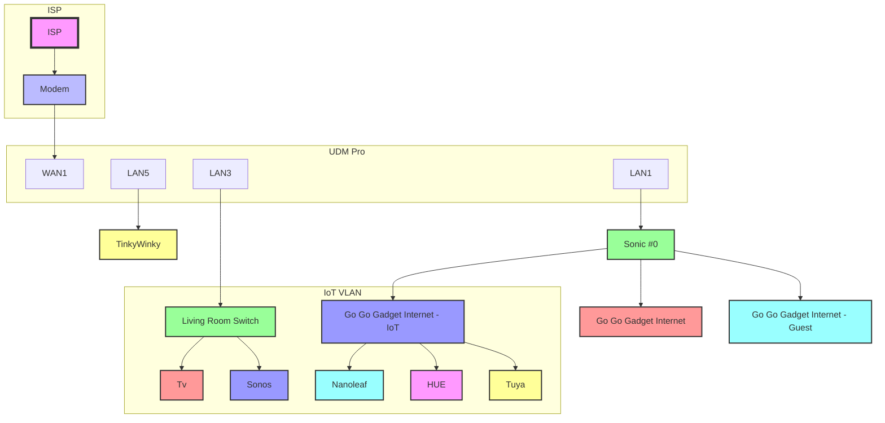

# Implementation

## Objectives

- **Secure** networks for all devices : 0-trust networks by default
- **Fast** and **reliable** internet connection : Up to 10Gbe for servers and mesh wifi for the rest
- **Privacy** first : Block ads and trackers for all devices with Pi-Hole (since the Ad-blocker from Unifi is not that great)
- **Remote access** to my home network : Using WireGuard VPN
- **Monitoring** : Keep an eye on the network with Grafana and Prometheus
- **Backup** : Backup all my data with a self-hosted solution

## Network description

**3 VLANs:**

- **1** : \*\*\*\*Master [10.42.0.0/24] : is used for servers and myself
- **10** : IoT [10.42.10.0/24] : 0 trust network for all IoT devices (i.e. lamps, sonos, tv, …)
- **255** : Guest [10.42.255.0/24] : 0 trust network for any friends coming over

**3 SSIDs:**

- Go Go Gadget Internet → Master VLAN
- Go Go Gadget Internet - IoT → IoT VLAN
- Go Go Gadget Internet - Guest → Guest VLAN

**1 AP for the moment broadcasting the 3 VLANs**

**Main devices:**

- **TinkyWinky** : Workstation with UnraidOS used for storage and compute (Linux VMs and dockers).
  - Specs:
    - Threadripper 1920X
    - 2x 2080 Ti
    - 24TB HDD for storage
    - 3TB NVme for VMs
    - 512GB SSD for cache
    - 10GB RJ45
  - Dockers:
    - Plex for movies and tv shows streamed to TV
    - Bitwarden for password management
    - Caddy for reverse proxy and SSL

**LAN firewall rules:**

1. ✅ Allow master to all VLANs
2. ✅ Allow TV to access Plex on TinkyWinky
3. ✅ Allow established and related connections (allow other VLANs to communicated if initiated by master VLAN)
4. ✅ Allow IoT VLAN to access Home Assistant on TinkyWinky
5. ❌ Drop invalid state
6. ❌ Block all traffic matching RFC1918 (all local IPv4 addresses)

## Dockers

### Pi-Hole

Pi-Hole is directly on the the UDM Pro using systemd to create a debian container. I followed the [guide](https://github.com/unifi-utilities/unifios-utilities/tree/main/nspawn-container) from unifi-utilities for UnifiOS 3.x+.

### All dockers on tinkywinky

- **Caddy** : Reverse proxy and SSL and is the only one exposed to the internet and lan, the others are only accessible from an internal docker network from Caddy.
- **Bitwarden** : Password manager accessible through Caddy.
- **Nextcloud** : Cloud storage accessible through Caddy.
- **n8n** : Automation tool accessible through Caddy.

## External access

### WireGuard

The plan is to use wireguard to access my home network from anywhere. The only problem right now is that Unifi doesn't support IPv6 for the easy wireguard setup so I'll have to tweak the configuration a bit to make it work.

# Limitations

- **IPv6** :
  - First, my ISP only provides IPv6 subnet and no public IPv4 address so for the moment, I can't access my setup from an IPv4 only network, but it could be solved with either another proxy or a VPN on a VPS, or simply using Cloudflare Tunnels but I'm not sure I want all my traffic to be visible by Cloudflare.
  - Unifi doesn't seem to acknowledge the existence of IPv6 for some services (Wireguard, ...), which is a bit annoying.

# Future improvements

- **External access** : If I want to open some of the instances to the internet, I'll probably switch to Traefik with Authelia for authentication and give access to only trusted users.

