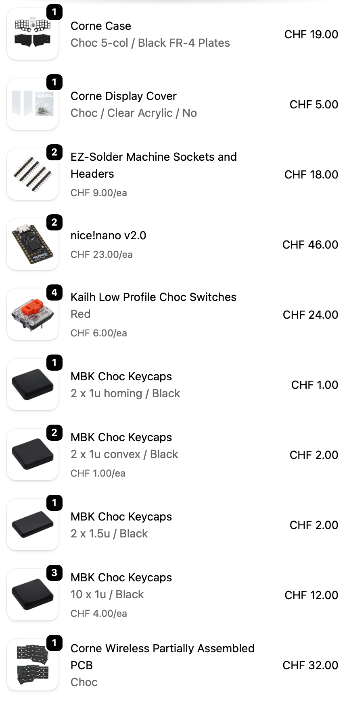

import { PhotoStackWithGallery } from '@/components/gallery';
import image0 from './images/0.jpg';
import image1 from './images/1.jpg';
import image2 from './images/2.jpg';
import image3 from './images/3.jpg';
import image4 from './images/4.jpg';

I always wanted to build a small factor and split keyboard for 2 reasons.

0. The first is _speed_: I'm honestly very bad at typing fast, I usually type with few fingers, move my hands everywhere and hit all keys on the way with my fat fingers.
1. The second is _comfort_: I never really felt comfortable on a normal keyboard.

In my opinion there's no better way to achieve these than by having a keyboard where the keymaps (and combos, ...) can be fully customized to accomodate for any comfort/speed ratio I want. Plus, the fact that the keyboard is split will force me to make the neural mapping (I should obviously force myself to use the correct fingers for the correct keys to learn good habits).

I initially build this keyboard in December 2023 but then never used it because the change was too big between a normal keyboard and a split/custom one so it was seating on my desk, ready to be picked up, and today is the day.

# Build

  <PhotoStackWithGallery
    size="lg"
    images={[
      { src: image0, alt: 'Base board' },
      { src: image1, alt: 'All components' },
      { src: image2, alt: 'Battery attached' },
      { src: image3, alt: 'All keys attached' },
      { src: image4, alt: 'Final result' },
    ]}
  />

I went with a [Corne 5x3+3 layout](https://keebd.com/products/corne-cherry-v3-rgb-keyboard-kit) with [nice!nano](https://nicekeyboards.com/nice-nano/) and no displays at the moment.

The build is quite easy, you just need a soldering iron and all the components (you can find what I bought [at the bottom of this page](#all-components)), then simply assemble the two microships with their batteries, click all the keys and the keycaps and you're good to go.

# Software

As I'm not yet very familiar with split keyboards I didn't want to go with a crazy layout that's too far from what I know, I need to first learn how to handle the the different layers and where to find the special characters but not the letters themselves so I'll go for a simple QWERTY with smart hold-layers.

I obviously didn't want to reinvent the wheel so I went for a popular solution that could be embedded on a 5x3+3 layout with QWERTY alphas and found [Miryoku](https://github.com/manna-harbour/miryoku) but I reimplemented the layout to be compatible with [ZMK](https://zmk.dev/) (tbh the original implementation is quite bloated, I just needed a minimal setup and to understand how I could modify it), you can find the repository [here](https://github.com/romaingrx/corne-zmk-config).

# Next steps

1. Now, it's time to fight and get the mapping in my brain
2. I could add some displays but I think I value more having a lot of battery rather than having visual feedback on my keyboard
3. The moment I'm familiar enough with the current layout, I could definitely try a less conventional layout that would be better for coding

<Accordion title="All components" id="all-components">
    Not the cleanest, but here's a screenshot of all components.

    

</Accordion>
